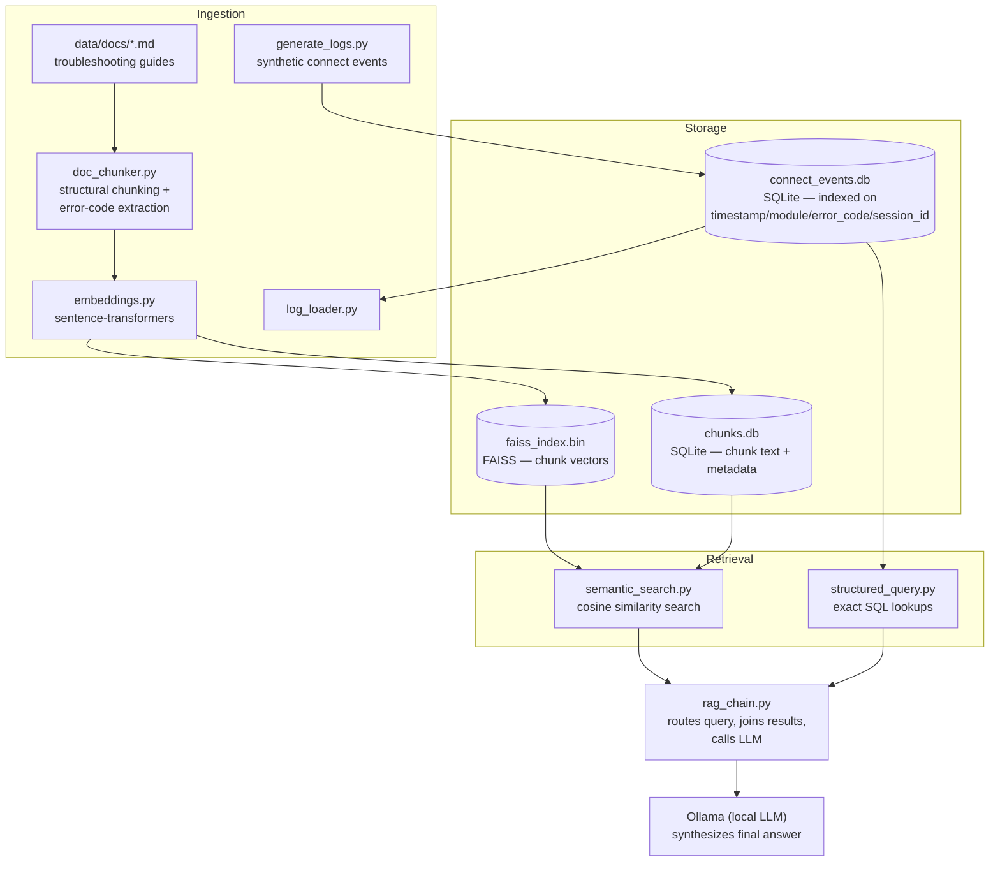
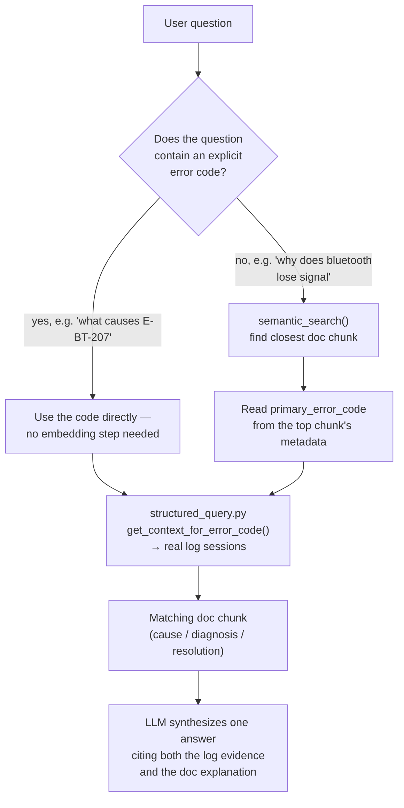

# Vehicle Connect RAG

A retrieval-augmented trace analysis assistant for a connected-vehicle
infotainment/connect platform. Built as a portfolio project exploring how
RAG applies to systems/trace data, not just document Q&A.

## What it does

Combines two retrieval modes over connect-module event data (bluetooth,
wifi, infotainment boot, cloud sync, navigation, voice assistant):

- **Structured retrieval** — indexed SQL queries over event logs (time
  range, module, error code, session).
- **Semantic retrieval** — embedding-based search over troubleshooting
  documentation, chunked by section so each error code's cause/diagnosis/
  resolution stays intact as one retrievable unit.

The two are joined by `error_code`: a log event tells you *what happened
and when*; the matching doc section tells you *why it happens and what to
do about it*. Neither alone answers a real trace-analysis question.

## Why this architecture

RAG is usually presented as one pattern: embed everything, search
semantically, hand the top-k chunks to an LLM. That pattern fails on
system/trace data, and the reasoning behind each deviation from it is the
actual point of this project.

### Two retrieval modes, not one

Logs are exact records — a real event happened at a real timestamp, with a
real error code. Asking "what happened between 14:02 and 14:05" is a
*filtering* problem (`WHERE timestamp BETWEEN ...`), not a *similarity*
problem — embedding a timestamp and searching for "nearby" vectors makes
no sense. So logs go into SQLite, indexed on the columns we actually
filter by, and get queried with plain SQL. Docs, by contrast, need to
match a user's *phrasing* of a problem to the right explanation even when
they don't share vocabulary — that's what embeddings are for. One data
source per data source's actual shape, not one retrieval strategy
stretched over both.

### Structural chunking over semantic/agentic chunking

Semantic chunking (cluster by embedding similarity) and agentic chunking
(have an LLM decide boundaries) both exist to *guess* where topic
boundaries are when a document gives no other signal. Our docs already
give that signal explicitly — every `##`/`###` markdown heading is a
hand-authored boundary (`## E-BT-207 — Signal lost...` is already exactly
the retrievable unit we want). Paying compute to statistically
re-discover a boundary that's already marked would be worse, not more
sophisticated. This only holds because the source is structured
documentation — a real extension of this project (see Status) would add
semantic chunking specifically for unstructured sources, rather than
applying one chunking strategy uniformly everywhere.

### FAISS + SQLite over a managed vector database

A vector database like Chroma bundles storage, metadata, and search
behind one API — convenient, but it hides what's actually happening.
FAISS only does the nearest-neighbor math; we pair it with our own SQLite
table (`id` = FAISS insertion order) the same way we already paired
structured queries with the log store. This is deliberately the more
transparent choice: understanding *why* `IndexFlatIP` + `normalize_L2`
gives you cosine similarity is a stronger signal than knowing how to call
a library that does it invisibly. `IndexFlatIP` (exact brute-force
search) is the right choice at our scale — 30-ish chunks; an approximate
index (IVF/HNSW) only pays for itself in the millions.

### Local embeddings, local LLM synthesis

Sentence-transformers (`all-MiniLM-L6-v2`) runs the embedding step
locally — free, instant, no API key. This mattered practically, not just
philosophically: building this pipeline meant re-running the indexing
step constantly while debugging (see the chunking bugs below), and a
paid API in that loop would have meant real cost per debug cycle. Final
answer synthesis — the one LLM call that actually needs strong language
generation — runs through a local model via Ollama for the same reason:
free iteration, no account/key setup required to try the project.

### Why the data is synthetic, on purpose

Real connected-vehicle logs are proprietary, and no public dataset pairs
raw traces with matching documentation for a specific manufacturer's
platform — that pairing doesn't exist publicly for anyone outside the
OEM. So the logs and docs here are self-authored and explicitly
synthetic, generated by `src/ingest/generate_logs.py` with a fixed random
seed. The rigor this project claims isn't "the data is real" — it's that
the retrieval architecture is demonstrably correct and evaluable, which
matters more for a portfolio piece than data provenance does.

## Architecture

## How a query resolves

The core design decision: prefer exact lookups over fuzzy ones whenever
possible. A query only falls back to semantic search when the user's
question doesn't already contain enough to look things up directly.

**Worth noting from actually building this:** the first version derived
the error code from a chunk's `error_codes` metadata field (all codes
*mentioned* in the chunk's text) instead of a dedicated
`primary_error_code` field (the code the chunk's heading is actually
*about*). Because the `E-BT-207` doc section mentions `E-BT-104` for
comparison ("distinct from E-BT-104..."), that bug caused vague queries
to sometimes resolve to the wrong error code entirely — right chunk
retrieved, wrong code extracted from it. A concrete example of why a
"mentioned in" field and a "the subject of" field need to be different
fields, not one field doing both jobs.

## Evaluation

`src/eval/eval_retrieval.py` runs 15 hand-written questions
(`src/eval/eval_set.py`) against the routing logic and checks whether it
resolves to the correct error code — one question per error code, one
explicit-code query (should skip embedding search entirely), and one
question deliberately written to be hard: a full paraphrase of the
`E-BT-207` scenario with no shared vocabulary with the doc text.

**Result: 14/15 (93.3%) retrieval accuracy.**

The one failure is worth explaining rather than hiding, because it's a
real, diagnosed limitation, not a random miss:

> *"my phone keeps randomly disconnecting from the car while driving"*
> resolves to `E-BT-104` (pairing handshake timeout) instead of the
> correct `E-BT-207` (signal lost during an active session).

This is a **different bug** from the `primary_error_code` metadata issue
above — that fix changed how we *read* the top search result, not how the
embedding model *ranks* results, and for this specific paraphrase the
ranking itself still favors the wrong chunk. Working hypothesis: the
`E-BT-207` doc section's own text says *"Distinct from E-BT-104
because..."* — which means the literal string `E-BT-104` sits inside
`E-BT-207`'s embedded chunk text. A sentence written to help a human
reader disambiguate two errors may be quietly pulling the `E-BT-207`
chunk's vector toward `E-BT-104`'s semantic neighborhood, since the
embedding model can't distinguish "mentions X for contrast" from "is
related to X."

This is left as a **documented known limitation** rather than patched —
a system whose failure modes are identified, explained, and measured is
more credible than one that happens to score 100% on 15 hand-picked
questions with no visibility into where it would break on a 16th.

## Data

The event logs and documentation in `data/` are **synthetic**, generated
by scripts in this repo (`src/ingest/generate_logs.py`). See *Why this
architecture* above for the reasoning.

## Status

The core pipeline is implemented end to end: synthetic log generation
(`src/ingest/generate_logs.py`), a structured log store indexed on
timestamp/module/error_code/session_id (`src/ingest/log_loader.py`),
structural documentation chunking with error-code metadata extraction
(`src/ingest/doc_chunker.py`), embeddings and a FAISS vector store
(`src/ingest/embeddings.py`), hybrid retrieval that combines structured
log queries (`src/retrieval/structured_query.py`) with semantic doc
search (`src/retrieval/semantic_search.py`) and routes between them
(`src/pipeline/rag_chain.py`), and LLM synthesis via a local model
(`llama3.1:8b` through Ollama) that turns retrieved evidence into a
grounded, cited answer.

The evaluation harness currently covers retrieval accuracy (14/15, see
*Evaluation* above); answer-correctness / groundedness metrics and a
simple UI are still planned.

### Possible extensions

- A second, genuinely unstructured retrieval source (e.g. general
  real-world troubleshooting content) using semantic chunking — see the
  chunking-strategy reasoning above for why this is additive, not a
  replacement for structural chunking on the existing docs.
- Swap the synthetic log generator for real public CAN bus data (e.g. the
  HCRL Car-Hacking or ROAD datasets), decoded through a self-built
  DBC-style translation layer — see *Why the data is synthetic* above.
